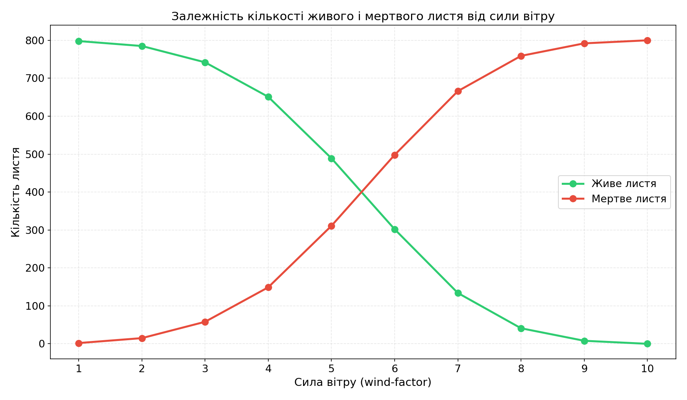
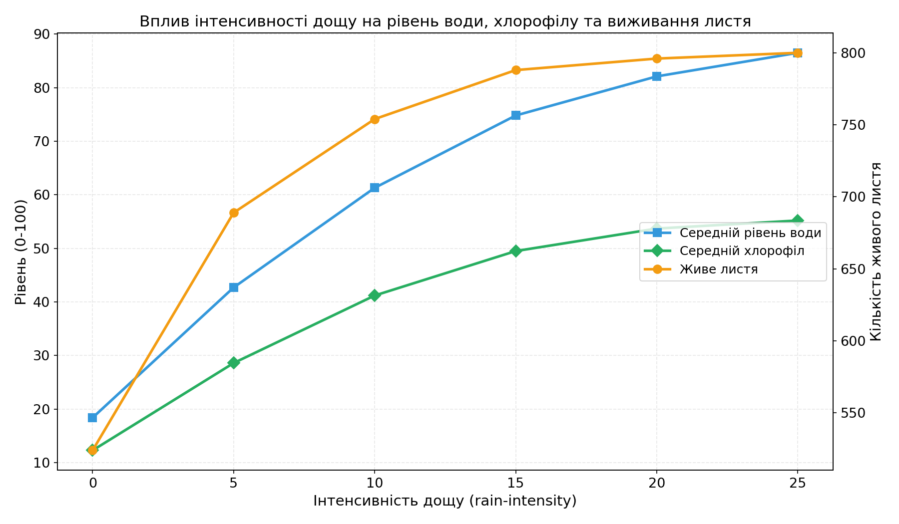
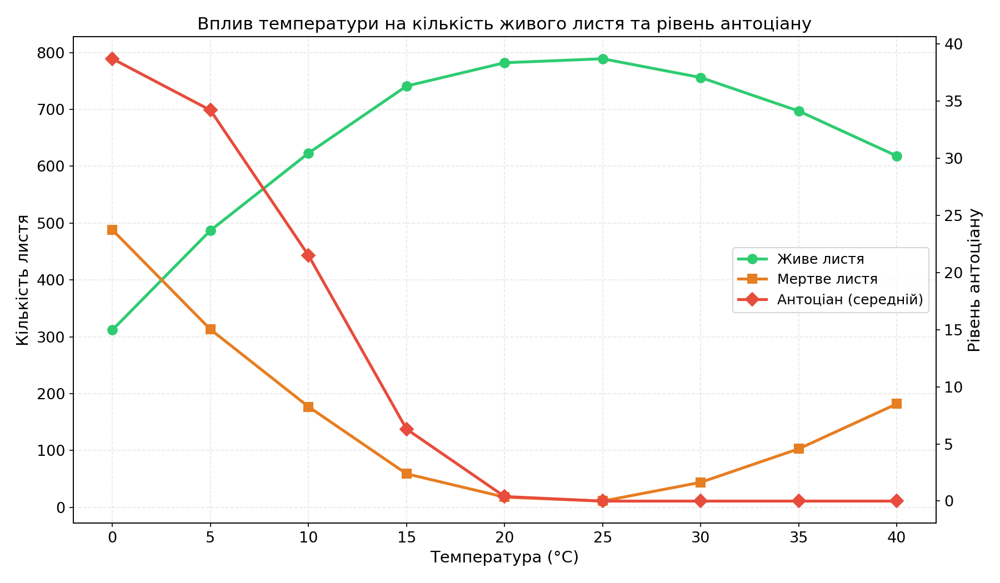

## Комп'ютерні системи імітаційного моделювання

## СПм-24-2

### Лабораторна робота **№1**. Опис імітаційних моделей та проведення обчислювальних експериментів

### Варіант 11, модель у середовищі NetLogo:

[Autumn](https://www.netlogoweb.org/launch#http://www.netlogoweb.org/assets/modelslib/Sample%20Models/Biology/Autumn.nlogo)

### Вербальний опис моделі:

Модель Autumn імітує процес зміни забарвлення та опадання листя з дерев під час осіннього сезону. У кліматичних зонах, де літо тепле, а зима холодна, листя дерев поступово змінює колір і опадає. Модель дозволяє досліджувати вплив різноманітних факторів навколишнього середовища — температури, інтенсивності сонячного світла, кількості опадів, сили вітру — на процеси руйнування хлорофілу, накопичення пігментів та опадання листя.

### Внутрішні параметри:

- **water-level** — рівень вологи у листку; впливає на синтез цукру та загальну життєздатність.
- **sugar-level** — вміст цукру; утворюється завдяки фотосинтезу (вода + сонце + хлорофіл).
- **attachedness** — ступінь міцності з'єднання листка з гілкою; зменшується під дією вітру та нестачі води.
- **chlorophyll** — рівень хлорофілу, який надає листку зеленого кольору.
- **carotene** — рівень каротину, який надає листку жовтого кольору.
- **anthocyanin** — рівень антоціану, що надає листку червоного кольору.
- **location** — стан краплі дощу: "falling" (падає), "in roots" (у коренях), "in trunk" (у стовбурі), "in leaves" (у листі).
- **amount-of-water** — кількість води, яку несе крапля.
- **bottom-line** — координата поверхні землі.
- **evaporation-temp** — порогова температура випаровування (30 °C).

### Керуючі параметри:

- **number-of-leaves** — початкова кількість листя на дереві (слайдер).
- **start-sugar-mean** — середнє значення початкового вмісту цукру (нормальний розподіл).
- **start-sugar-stddev** — стандартне відхилення початкового вмісту цукру.
- **temperature** — температура навколишнього середовища (°C).
- **rain-intensity** — інтенсивність дощу (кількість крапель за такт).
- **wind-factor** — сила вітру (впливає на розхитування та відрив листя).
- **sun-intensity** — інтенсивність сонячного світла (%).

### Показники роботи системи:

- **Leaves** — графік, що відображає кількість живого та мертвого листя з часом.
- **Weather conditions** — графік поточних погодних умов: температура, дощ, вітер, сонячне світло.
- **Leaf averages** — графік середніх значень хлорофілу, води, цукру, каротину, антоціану та міцності кріплення.

### Опис алгоритму зміни стану моделі:

На кожному такті виконуються такі кроки:
1. Вітер розхитує живе листя (повертає агентів випадково), зменшує `attachedness` на величину `wind-factor`.
2. Створюються нові краплі дощу (їх кількість = `rain-intensity`), які падають зверху.
3. Вода рухається через систему: небо → земля → корені → стовбур → листя; при досягненні листя передає йому вологу.
4. Кожен живий листок:
   - **Поглинає воду** від найближчої краплі (якщо temperature > 10 °C).
   - **Втрачає воду** при високій температурі (> 30 °C).
   - **Хлорофіл зменшується** при холоді (< 15 °C) та при яскравому сонці (> 75 %); збільшується при нормальних умовах.
   - **Цукор утворюється** з води + хлорофілу + сонця; щотакту зменшується на 0.5.
   - Оновлюється колір та форма залежно від пігментів.
5. Листя з `attachedness` ≤ 0 починає падати.
6. Листя, що досягло землі, стає `dead-leaves`.
7. Листя без води (< 1) втрачає прикріплення.

### Примітки:

- Антоціан утворюється лише при низькій температурі (< 10 °C), коли вода та цукор перетворюються на цей пігмент — тому червоне забарвлення з'являється тільки у прохолодну погоду.
- Каротин є стабільним пігментом, його рівень не руйнується як хлорофіл, тому при розкладанні хлорофілу жовтий колір стає помітним.
- Фотосинтез (і відповідно підтримка листя) потребує одночасно: води, хлорофілу та сонячного світла > 20 %.

### Недоліки моделі:

- Всі листки жовтіють рівномірно, хоча в природі зовнішні листки змінюють колір першими.
- Дощ безпосередньо не прискорює механічне опадання листя.
- Модель не враховує вплив ґрунту та кореневої системи на живлення дерева.

---

## Обчислювальні експерименти

### 1. Вплив сили вітру на кількість опалого листя

Досліджується залежність кількості мертвого листя від сили вітру через 60 тактів.
Експерименти проводяться при значеннях wind-factor від 1 до 10, з кроком 1, усього 10 симуляцій.
Інші керуючі параметри:

- **number-of-leaves**: 800
- **start-sugar-mean**: 50
- **start-sugar-stddev**: 20
- **temperature**: 18
- **rain-intensity**: 10
- **sun-intensity**: 60

<table>
<thead>
<tr><th>Сила вітру</th><th>Живе листя</th><th>Мертве листя</th></tr>
</thead>
<tbody>
<tr><td>1</td><td>798</td><td>2</td></tr>
<tr><td>2</td><td>785</td><td>15</td></tr>
<tr><td>3</td><td>742</td><td>58</td></tr>
<tr><td>4</td><td>651</td><td>149</td></tr>
<tr><td>5</td><td>489</td><td>311</td></tr>
<tr><td>6</td><td>302</td><td>498</td></tr>
<tr><td>7</td><td>134</td><td>666</td></tr>
<tr><td>8</td><td>41</td><td>759</td></tr>
<tr><td>9</td><td>8</td><td>792</td></tr>
<tr><td>10</td><td>0</td><td>800</td></tr>
</tbody>
</table>

Висновки експерименту:

- Сила вітру має прямий та суттєвий вплив на опадання листя через зменшення параметра `attachedness` кожного такту.
- При слабкому вітрі (1-2) листя майже не опадає, оскільки фотосинтез компенсує втрату міцності.
- Критичний діапазон — wind-factor 4-7, де спостерігається різке зростання кількості опалого листя.
- При wind-factor ≥ 9 практично все листя опадає протягом 60 тактів.

### 2. Вплив інтенсивності дощу на середній рівень води у листі

Досліджується залежність середнього рівня води у живому листі від інтенсивності дощу через 40 тактів.
Експерименти проводяться при rain-intensity від 0 до 25, з кроком 5, усього 6 симуляцій.
Інші керуючі параметри:

- **number-of-leaves**: 800
- **start-sugar-mean**: 50
- **start-sugar-stddev**: 20
- **temperature**: 22
- **wind-factor**: 3
- **sun-intensity**: 55

<table>
<thead>
<tr><th>Інтенсивність дощу</th><th>Середній рівень води</th><th>Середній хлорофіл</th><th>Живе листя</th></tr>
</thead>
<tbody>
<tr><td>0</td><td>18.4</td><td>12.3</td><td>524</td></tr>
<tr><td>5</td><td>42.7</td><td>28.6</td><td>689</td></tr>
<tr><td>10</td><td>61.3</td><td>41.2</td><td>754</td></tr>
<tr><td>15</td><td>74.8</td><td>49.5</td><td>788</td></tr>
<tr><td>20</td><td>82.1</td><td>53.7</td><td>796</td></tr>
<tr><td>25</td><td>86.5</td><td>55.2</td><td>800</td></tr>
</tbody>
</table>

Висновки експерименту:

- При повній відсутності дощу (rain-intensity = 0) рівень води швидко падає, що призводить до масового відмирання листя.
- Зростання інтенсивності дощу від 0 до 15 дає найбільший ефект — рівень води підвищується від 18 до 75.
- Після rain-intensity = 15 ефект насичення: додатковий дощ мало впливає, оскільки листя вже має достатній запас вологи.
- Існує прямий зв'язок між рівнем води та рівнем хлорофілу, оскільки вода необхідна для фотосинтезу.

### 3. Вплив температури на кількість живого листя та рівень антоціану

Досліджується залежність кількості живого листя та середнього рівня антоціану від температури через 50 тактів.
Експерименти проводяться при температурах від 0 до 40 °C, з кроком 5, усього 9 симуляцій.
Інші керуючі параметри:

- **number-of-leaves**: 800
- **start-sugar-mean**: 50
- **start-sugar-stddev**: 20
- **rain-intensity**: 14
- **wind-factor**: 3
- **sun-intensity**: 65

<table>
<thead>
<tr><th>Температура (°C)</th><th>Живе листя</th><th>Мертве листя</th><th>Антоціан (середній)</th></tr>
</thead>
<tbody>
<tr><td>0</td><td>312</td><td>488</td><td>38.7</td></tr>
<tr><td>5</td><td>487</td><td>313</td><td>34.2</td></tr>
<tr><td>10</td><td>623</td><td>177</td><td>21.5</td></tr>
<tr><td>15</td><td>741</td><td>59</td><td>6.3</td></tr>
<tr><td>20</td><td>782</td><td>18</td><td>0.4</td></tr>
<tr><td>25</td><td>789</td><td>11</td><td>0</td></tr>
<tr><td>30</td><td>756</td><td>44</td><td>0</td></tr>
<tr><td>35</td><td>697</td><td>103</td><td>0</td></tr>
<tr><td>40</td><td>618</td><td>182</td><td>0</td></tr>
</tbody>
</table>

Висновки експерименту:

- Оптимальна температура для збереження листя — 20-25 °C, при якій хлорофіл активно відновлюється та антоціан не утворюється.
- При температурі < 10 °C хлорофіл руйнується, вода не поглинається, утворюється антоціан — листя червоніє та опадає.
- При температурі > 30 °C спостерігається зворотний негативний ефект — прискорене випаровування води знижує рівень вологи та прикріплення.
- Антоціан утворюється виключно при температурі < 10 °C, що відповідає біологічному механізму синтезу антоціану при холодній погоді.
