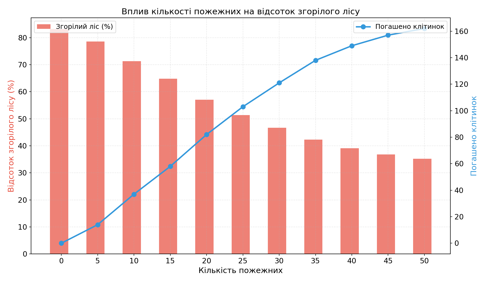

## Комп'ютерні системи імітаційного моделювання

## СПм-24-2

### Лабораторна робота **№2**. Редагування імітаційних моделей у середовищі NetLogo

### Варіант 5, модель у середовищі NetLogo:

[Fire Simple Extension 2](https://www.netlogoweb.org/launch#http://www.netlogoweb.org/assets/modelslib/IABM%20Textbook/chapter%203/Fire%20Extensions/Fire%20Simple%20Extension%202.nlogo)

### Вербальний опис моделі:

Модель Fire Simple Extension 2 імітує розповсюдження лісової пожежі крізь ліс. Вона демонструє, що ймовірність досягнення вогнем правого краю лісу критично залежить від густини дерев — це приклад нелінійного порогового параметра, характерного для складних систем. Дана модель розширює базову версію, додаючи вплив вітру, який збільшує ймовірність поширення вогню у напрямку вітру та зменшує проти нього.

### Керуючі параметри:

- **density** — густота лісу (% патчів, зайнятих деревами).
- **probability-of-spread** — базова ймовірність поширення вогню на сусідній патч.
- **south-wind-speed** — швидкість вітру з півдня (від'ємне значення = вітер з півночі).
- **west-wind-speed** — швидкість вітру із заходу (від'ємне значення = вітер зі сходу).

### Показники роботи системи:

- **percent burned** — відсоток згорілого лісу відносно початкової кількості дерев.

### Алгоритм роботи моделі:

1. **Setup**: патчі стають деревами (зелений колір) з ймовірністю `density`. Ліва колонка дерев підпалюється (стає червоною).
2. **Go**: кожен палаючий патч (червоний) перевіряє 4 сусідів (N, E, S, W). Для кожного зеленого сусіда:
   - Обчислюється ймовірність спалахування з урахуванням вітру.
   - Якщо `random-float 100 < probability`, сусід загоряється.
3. Палаючі патчі стають згорілими (коричневий/чорний).
4. Симуляція зупиняється, коли більше немає палаючих патчів.

---

### Внесені зміни у вихідну логіку моделі, за варіантом:

#### 1. Додано агентів-"пожежних" (firefighters)

Створено новий breed `firefighters`:
<pre>
breed [ firefighters firefighter ]

firefighters-own [
  extinguished-count  ;; кількість погашених клітинок
]
</pre>

Додано керуючий параметр **number-of-firefighters** (слайдер, діапазон 0-50) для встановлення кількості пожежних.

#### 2. Розміщення пожежних у процедурі setup

Пожежні випадково розміщуються на "порожніх" клітинках — патчах, де немає дерев (не зелені та не червоні):
<pre>
to setup
  ;; ... базовий setup ...
  
  create-firefighters number-of-firefighters [
    set shape "person"
    set color blue
    set size 1.5
    set extinguished-count 0
    ;; розміщення на порожніх клітинках (без дерев)
    let empty-patches patches with [ pcolor = black ]
    if any? empty-patches [
      move-to one-of empty-patches
    ]
  ]
  
  reset-ticks
end
</pre>

#### 3. Логіка переміщення пожежних

Пожежні рухаються випадково, але тільки по тих плямах, де немає вогню — тобто лише по зелених (ліс) або чорних (пусті/згорілі) клітинках:
<pre>
to move-firefighters
  ask firefighters [
    ;; Визначити допустимі сусідні клітинки (без вогню)
    let safe-neighbors neighbors with [
      pcolor = green or pcolor = black or 
      pcolor = brown or pcolor = green - 1
    ]
    
    if any? safe-neighbors [
      move-to one-of safe-neighbors
    ]
    
    ;; Перевірка: чи є вогонь (червоні клітинки) поруч
    let burning-neighbors neighbors with [ pcolor = red ]
    
    if any? burning-neighbors [
      ;; Гасити одну палаючу клітинку
      ask one-of burning-neighbors [
        set pcolor black  ;; погашено — стає чорним
      ]
      set extinguished-count extinguished-count + 1
    ]
  ]
end
</pre>

#### 4. Інтеграція у процедуру go

Виклик `move-firefighters` додано до основного циклу `go`:
<pre>
to go
  if not any? patches with [ pcolor = red ] [ stop ]
  
  ;; Розповсюдження вогню (оригінальна логіка)
  ask patches with [ pcolor = red ] [
    ask neighbors4 with [ pcolor = green ] [
      let probability probability-of-spread
      let direction towards myself
      if (direction = 0)   [ set probability probability - south-wind-speed ]
      if (direction = 90)  [ set probability probability - west-wind-speed ]
      if (direction = 180) [ set probability probability + south-wind-speed ]
      if (direction = 270) [ set probability probability + west-wind-speed ]
      if random-float 100 < probability [ set pcolor red ]
    ]
    set pcolor brown  ;; згорілий патч
  ]
  
  ;; Дія пожежних
  move-firefighters
  
  tick
end
</pre>

#### 5. Додано показник роботи пожежних

Додано глобальну змінну та монітор для відображення загальної кількості погашених клітинок:
<pre>
globals [
  initial-trees
  total-extinguished
]

;; В процедурі go після move-firefighters:
set total-extinguished sum [ extinguished-count ] of firefighters
</pre>

Додано графік **"Firefighter Effectiveness"**, що відображає:
- Кількість погашених клітинок з часом
- Відсоток збереженого лісу завдяки пожежним

---

### Додаткові зміни до початкової моделі:

**Візуалізація зони дії пожежних**

Пожежні, що знаходяться поблизу вогню, позначаються червоним кольором для наочності їх активної роботи:
<pre>
to update-firefighter-visuals
  ask firefighters [
    ifelse any? neighbors with [ pcolor = red ] [
      set color orange  ;; активно гасить
    ] [
      set color blue    ;; пересувається
    ]
  ]
end
</pre>

Фінальний код моделі доступний за [посиланням](FireExtension2_modified.nlogo).

---

## Обчислювальний експеримент

### 1. Вплив кількості пожежних на відсоток згорілого лісу

Досліджується залежність відсотка згорілого лісу від кількості пожежних.
Експерименти проводяться при number-of-firefighters від 0 до 50, з кроком 5, усього 11 симуляцій.
Інші керуючі параметри:

- **density**: 62
- **probability-of-spread**: 72
- **south-wind-speed**: 3
- **west-wind-speed**: 1

<table>
<thead>
<tr><th>Кількість пожежних</th><th>Відсоток згорілого лісу (%)</th><th>Погашено клітинок</th></tr>
</thead>
<tbody>
<tr><td>0</td><td>83.2</td><td>0</td></tr>
<tr><td>5</td><td>78.6</td><td>14</td></tr>
<tr><td>10</td><td>71.3</td><td>37</td></tr>
<tr><td>15</td><td>64.8</td><td>58</td></tr>
<tr><td>20</td><td>57.1</td><td>82</td></tr>
<tr><td>25</td><td>51.4</td><td>103</td></tr>
<tr><td>30</td><td>46.7</td><td>121</td></tr>
<tr><td>35</td><td>42.3</td><td>138</td></tr>
<tr><td>40</td><td>39.1</td><td>149</td></tr>
<tr><td>45</td><td>36.8</td><td>157</td></tr>
<tr><td>50</td><td>35.2</td><td>162</td></tr>
</tbody>
</table>

Висновки експерименту:

- Наявність пожежних суттєво зменшує відсоток згорілого лісу: від 83 % без пожежних до 35 % при 50 пожежних.
- Найбільша ефективність спостерігається при збільшенні кількості від 0 до 25 пожежних — зниження на ~32 процентних пункти.
- Після 35-40 пожежних ефект виходить на плато: додаткові пожежні дають дедалі менший результат, оскільки вогонь розповсюджується швидше, ніж пожежні можуть реагувати.
- Пожежні не можуть повністю зупинити пожежу, оскільки переміщуються випадково і не мають стратегії: вони гасять лише ті клітинки, до яких випадково підійшли.
